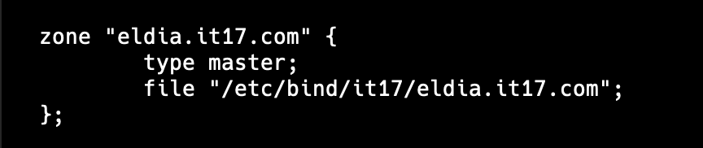
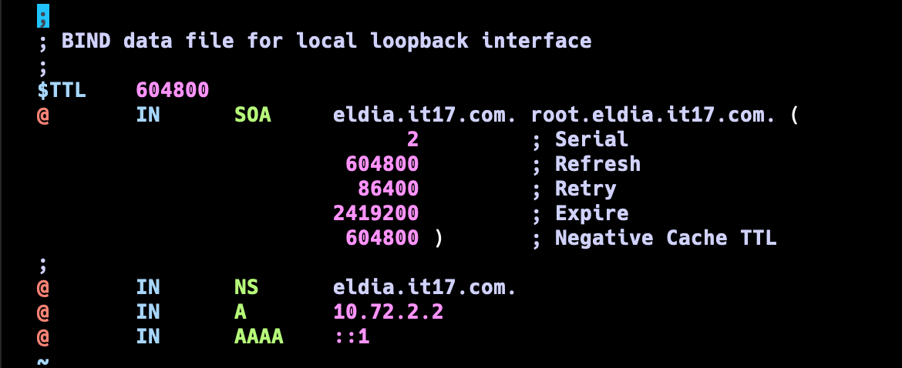
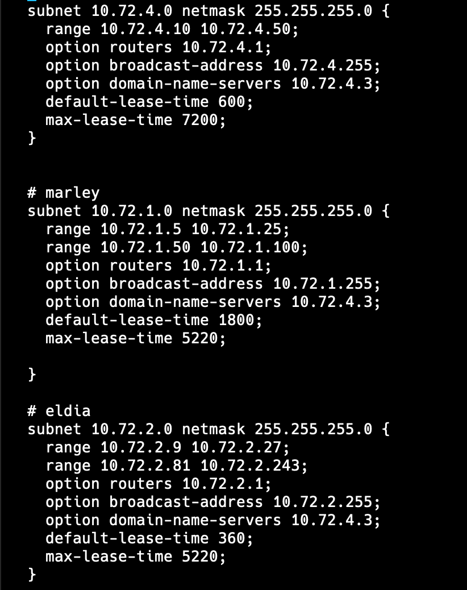

# DOKUMENTASI JARKOM PRAKTIKUM 3

## ANGGOTA

| Nama                        | NRP        |
| --------------------------- | ---------- |
| Athalla Barka Fadhil        | 5027231018 |
| Jody Hezekiah Tanasa Sagala | 5027221050 |

1. Masuk web console Fritz
2. `apt install && apt install bind9 -y`
3. `vi /etc/bind/named.conf.local`
   
4. `mkdir it17 && cd it17`
5. `vi eldia.it17.com`
   
6. `service bind9 restart`

7. Masuk web console Tybur
8. `apt install isc-dhcp-server -y`
9. `vi /etc/dhcp/dhcpd.conf`
   
10. `vi /etc/default/isc-dhcp-server`
    
11. `service isc-dhcp-server start`
